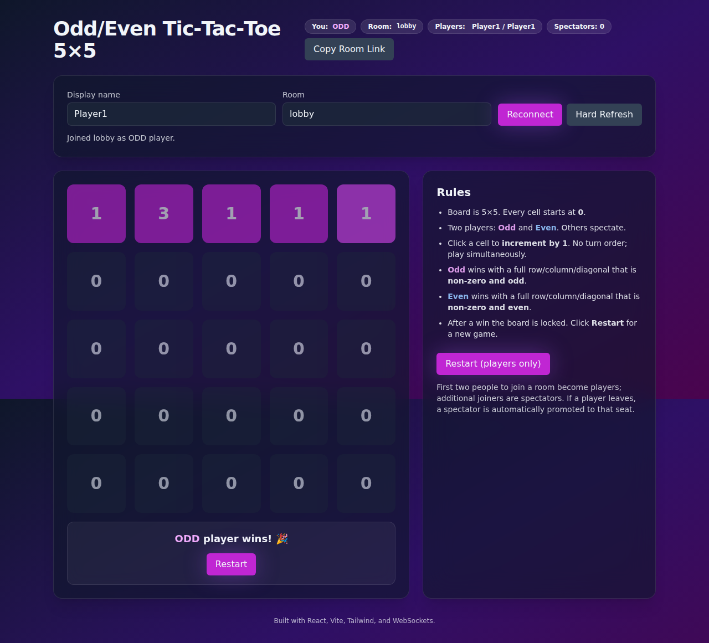

# NAVER-week2

## Odd/Even Tic-Tac-Toe 5×5

A multiplayer web-based game where two players compete on a 5×5 grid. Players increment cell values, and the Odd player wins with a row/column/diagonal of all odd numbers, while the Even player wins with all even numbers.

### Screenshots

#### Initial View (Odd Player)


The first player to join becomes the ODD player. The board starts with all cells at 0.

#### Two Players Connected


When a second player joins, they become the EVEN player. Both players can see each other's names displayed in the header.

#### Gameplay in Progress


Players can click any cell to increment its value by 1. Odd values are shown in pink/magenta, even values in blue.

#### Winning State


When a player creates a full row/column/diagonal of all odd or all even (non-zero) numbers, they win! The game board locks and a restart button appears.

---

## Installation Instructions

### Prerequisites

- **Node.js** (version 14 or higher recommended)
- **npm** (comes with Node.js)

### Step 1: Clone the Repository

```bash
git clone https://github.com/huynhtrankhanh/NAVER-week2.git
cd NAVER-week2/odd-even-tictactoe-5x5
```

### Step 2: Install Dependencies

Install dependencies for both the server and client:

```bash
npm run install-all
```

This will install:
- Server dependencies (Express, WebSocket)
- Client dependencies (React, Vite, Tailwind CSS)
- Root dependencies (concurrently for running both)

### Step 3: Build the Client

Build the React client application:

```bash
npm run build
```

This creates an optimized production build in `client/dist/`.

### Step 4: Start the Application

#### Option A: Production Mode (recommended)

Start the server which serves the built client:

```bash
npm start
```

The application will be available at `http://localhost:3001`

#### Option B: Development Mode

Run both server and client in development mode with hot reload:

```bash
npm run dev
```

- Server runs on `http://localhost:3001`
- Client development server runs on `http://localhost:5173`

---

## How to Play

1. **Open the application** in your web browser at `http://localhost:3001`

2. **Enter your name** in the "Display name" field

3. **Choose a room** or keep the default "lobby"

4. **Share the room link** with a friend by clicking "Copy Room Link"

5. **Game Rules:**
   - First two players to join become ODD and EVEN players
   - Click any cell to increment its value by 1
   - No turn order - play simultaneously!
   - **ODD player wins** with a full row/column/diagonal of odd numbers
   - **EVEN player wins** with a full row/column/diagonal of even numbers
   - After a win, click "Restart" to play again

6. **Additional Features:**
   - Multiple rooms supported - each room has its own game
   - Spectator mode - join a room with 2 players to watch
   - Automatic player promotion - if a player leaves, spectators are promoted
   - Reconnection handling - automatically reconnects if connection drops

---

## Project Structure

```
odd-even-tictactoe-5x5/
├── client/                 # React frontend
│   ├── src/
│   │   ├── App.jsx        # Main application component
│   │   ├── main.jsx       # React entry point
│   │   └── index.css      # Tailwind styles
│   ├── index.html         # HTML template
│   ├── package.json       # Client dependencies
│   └── vite.config.js     # Vite configuration
├── server/                # Express + WebSocket backend
│   ├── index.js          # Server entry point & game logic
│   └── package.json      # Server dependencies
└── package.json          # Root scripts
```

---

## Technologies Used

- **Frontend:** React 18, Vite, Tailwind CSS
- **Backend:** Node.js, Express, WebSocket (ws library)
- **Real-time Communication:** WebSocket for live multiplayer gameplay
- **Build Tool:** Vite for fast development and optimized production builds

---

## Troubleshooting

### Port already in use
If port 3001 is already in use, you can change it by setting the `PORT` environment variable:

```bash
PORT=3002 npm start
```

### WebSocket connection issues
Make sure your firewall allows connections on port 3001, or the custom port you've set.

### Build errors
Try clearing node_modules and reinstalling:

```bash
rm -rf node_modules client/node_modules server/node_modules
npm run install-all
```

---

## License

This project is part of the NAVER week2 assignment.